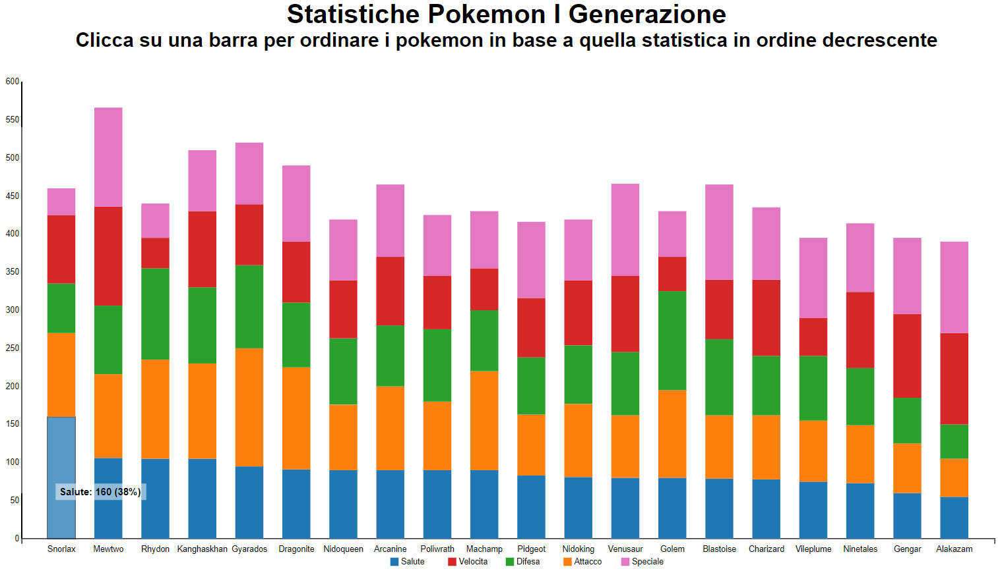

# Progetto Individuale infovis - Stacked Bar Chart con animazioni
Progetto d3.js per il corso di Visualizzazione delle Informazioni, Università Roma Tre, a.a. 2018-2019.

## Specifica del progetto

Crea un file json con dei dati multivariati: ci sono 20 data-point e ogni data-point ha cinque variabili quantitative i cui valori sono tutti positivi. Disegna questo dataset tramite un diagramma "stacked bars" (consulta le slides sulla visualizzazione dei dati multivairiati) in cui la prima variabile è usata per la porzione della barra inferiore, la seconda variabile è usata per la porzione di barra immediatamente superiore e così via. Facendo click con il pulsante sinistro del mouse su una porzione di una barra, tutte le barre della stacked bars vengono ordinate in orizzontale in base alla corrispondente variabile. Fai in modo che la riconfigurazione del diagramma avvenga in maniera fluida con una animazione.

## Funzionalità aggiuntiva
La seguente funzionalità, seppur non richiesta in maniera esplicita, rende migliore la visualizzazione dello Stacked Bar Chart:
- 
 Passando con il mouse sulle varie barre che rappresentano le varie statistiche dei pokemon, è possibile visionare alcuni dettagli: nome della statistica, valore numerico, valore percentuale rispetto alla somma totale delle statistiche di quel pokemon. La porzione della colonna viene evidenziata tramite un contorno di colore nero e ponendo un leggero effetto di opacità al suo interno 

## Caricamento dati da file esterno

 Qualora si volessero caricare i dati da file esterno, potremmo riscontrare dei problemi di sicurezza relativi alle politiche usate dal particolare Web Browser scelto. Per questo motivo, bisogna usare un server http.
<ul>
<li> 
Su un terminale Windows, dal prompt dei comandi bisogna spostarsi nella cartella in cui si trova il file index.html e, avendo Python installato, bisogna digitare il comando: <i><b>'python -m http.server [porta]'</b></i>. </li> 

<li> 
Su un terminale Linux, dal prompt dei comandi bisogna spostarsi nella cartella in cui si trova il file index.html e, avendo Python installato, bisogna digitare il comando: <i><b>'python -m SimpleHTTPServer [porta]'</b></i> o l'equivalente per Python3 <i><b>'python3 -m http.server [porta]'</b></i>. </li>

  </ul>

## Anteprima grafica

